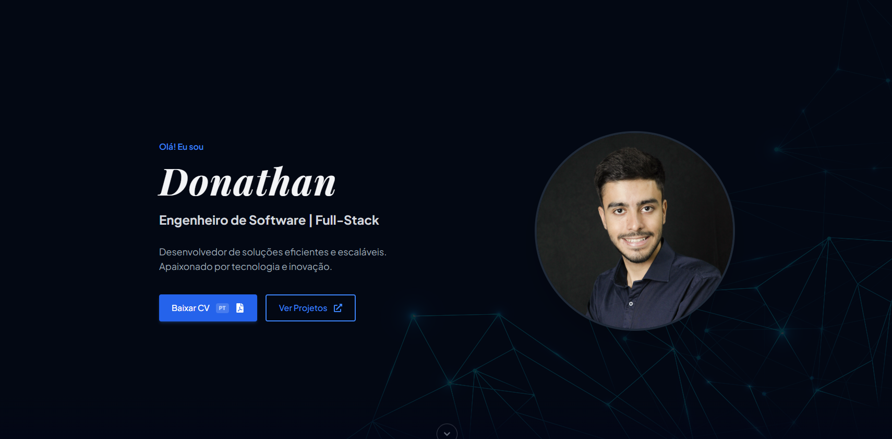

# Donathan Gonçalves | Software Engineer Portfolio


🌐 **Access the live project:** [https://donathan.com.br](https://donathan.com.br)

Personal portfolio built to showcase my projects, skills, and professional experience as a Fullstack Software Engineer. Designed with a focus on performance, clean architecture, and other languages.



## 🚀 Technologies Used

This project was built with modern web technologies:

*   **React + TypeScript:** For robust, scalable, and type-safe UI components.
*   **Vite:** Fast, modern build tool and development server.
*   **Tailwind CSS:** Utility-first CSS framework for rapid and highly customizable styling.
*   **Framer Motion:** For fluid, high-performance scroll and hover animations.
*   **i18next (react-i18next):** Complete internationalization (PT-BR / EN-US) architecture.

## ⚙️ Features

*   **100% Responsive Design:** Optimized for mobile, tablet, and desktop.
*   **Dynamic i18n:** Seamless language switching without page reloads, including dynamic resume (PDF) downloads based on the active language.
*   **Interactive UI:** Custom glassmorphism effects, gradient tracking on mouse hover, and smooth entry animations.
*   **SEO Optimized:** Semantic HTML, Open Graph tags, and standard robots/sitemap configuration.

## 🛠️ How to Run Locally

1. Clone the repository:
    ```bash
    git clone https://github.com/donathanramalho/Portfolio.git
    ````

2. Install the dependencies:
    ```bash
    cd portfolio
    npm install
    ```

3. Start the development server:
    ```bash
    npm run dev
    ```

## 📬 Contact

Feel free to reach out through my professional channels:

*   **Email:** donathan03@gmail.com
*   **GitHub:** https://github.com/donathanramalho
*   **LinkedIn:** https://www.linkedin.com/in/donathan-goncalves-89b06a181/
